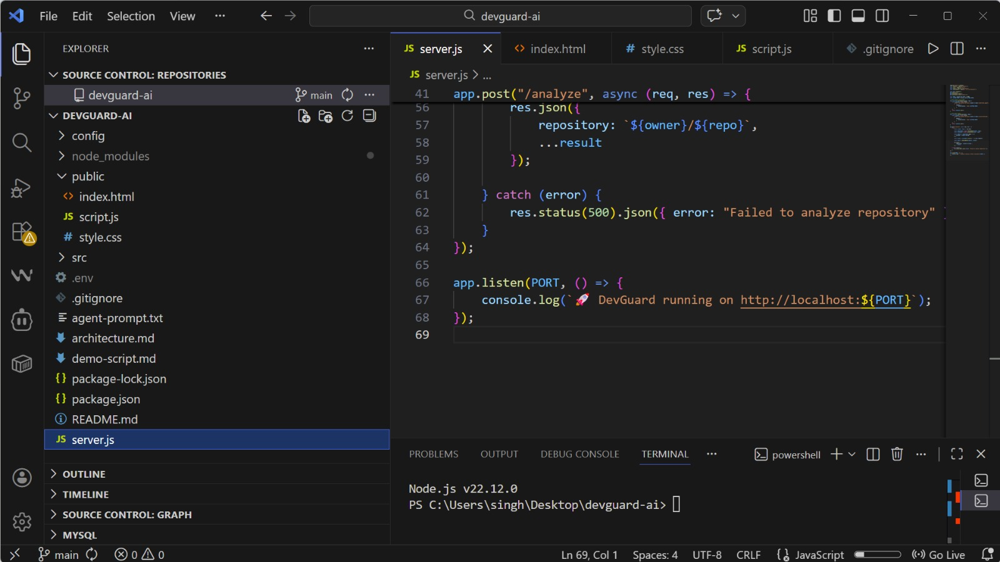
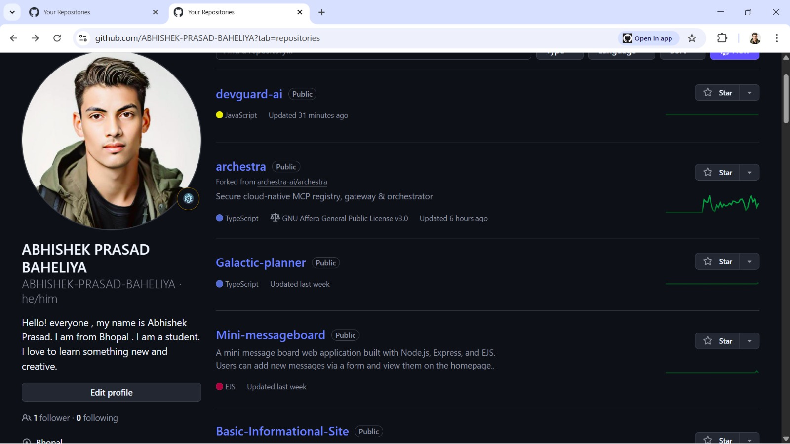
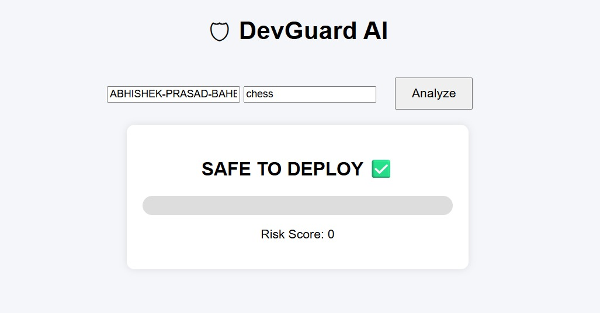
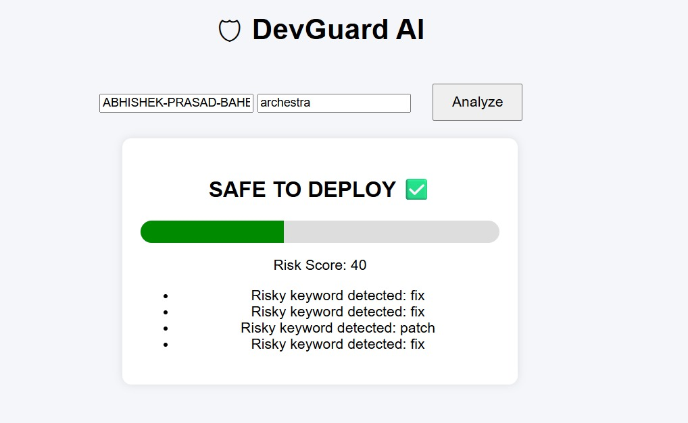
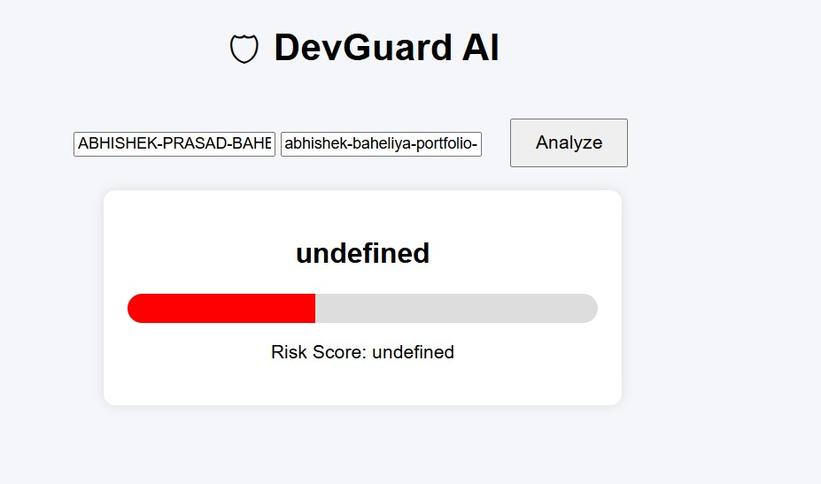
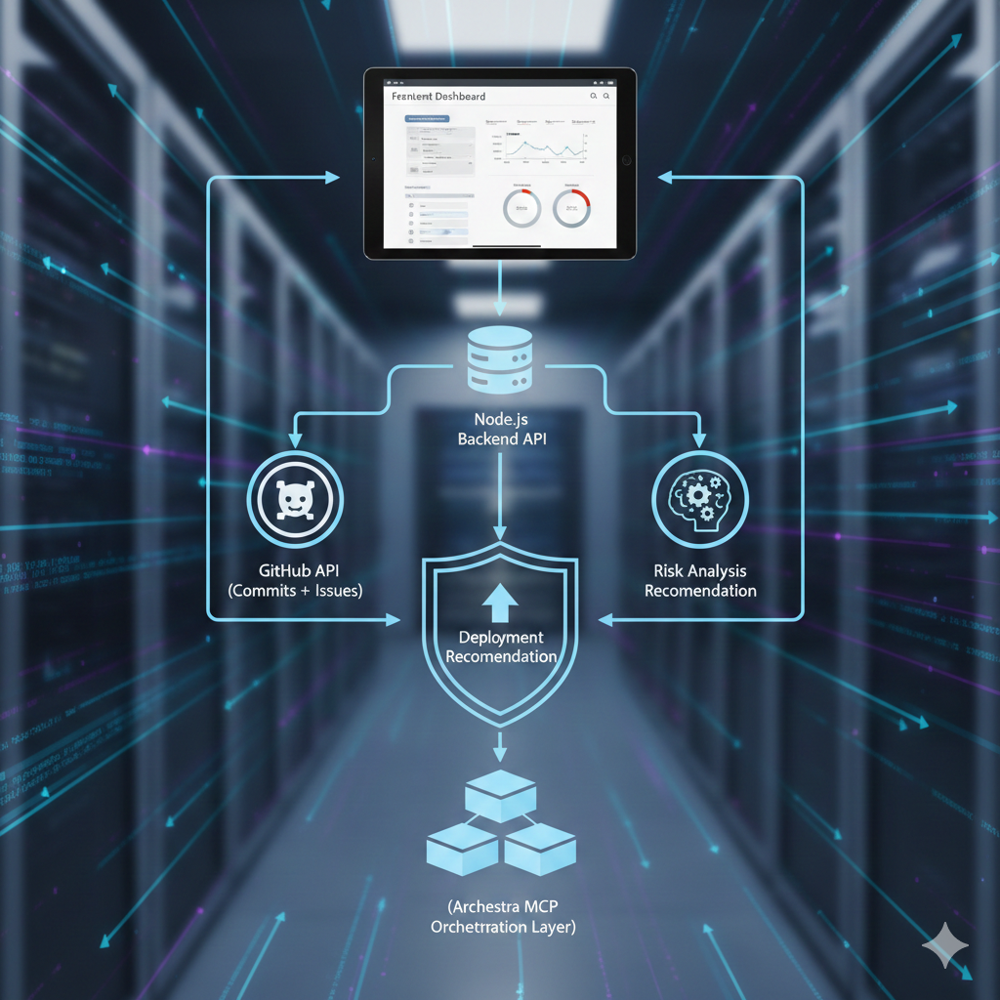

# 🛡 DevGuard AI

### AI-Powered Deployment Safety Controller

DevGuard AI is an MCP-powered deployment safety controller built using Archestra.

## It analyzes GitHub commits and open issues before approving deployments and provides structured risk recommendations.

## 🚀 Live Demo

🌐 **Deployed Application:**  
https://devguard-ai.onrender.com

🎥 **Demo Video:**
https://drive.google.com/file/d/1RkL-AF9ZxJ4i7g28NoKrLll5yc4cqHsa/view?usp=drive_link

---

## 📸 Demo Screenshots





[

### 🖥 Dashboard UI



### 📊 Risk Analysis Output





---

## 🧠 Problem Statement

Modern development teams deploy code rapidly without structured risk validation.  
This often leads to production failures, emergency hotfixes, and security risks.

There is no centralized AI control layer to validate deployment safety.

---

## 💡 Solution

DevGuard AI acts as an intelligent deployment gatekeeper.

Before any deployment, it:

- Fetches latest GitHub commits
- Checks open issues
- Detects risky patterns (hotfix, urgent, rollback, etc.)
- Calculates risk score (0–100)
- Provides recommendation:
  - ✅ SAFE TO DEPLOY
  - ⚠️ HIGH RISK

---

## 🏗 Architecture



Frontend Dashboard
↓
Node.js Backend API
↓
GitHub API (Commits + Issues)
↓
Risk Analysis Engine
↓
Deployment Recommendation
↓
(Archestra MCP Orchestration Layer)

---

## ⚙ Tech Stack

- Node.js
- Express.js
- GitHub REST API
- Render (Deployment)
- Archestra Platform
- MCP Integration

---

## 🧩 How Archestra is Used

Archestra acts as the centralized AI control plane:

- Orchestrates DevGuard Agent
- Connects securely to GitHub via MCP
- Enforces tool policies
- Provides governance and observability
- Enables multi-step reasoning

This transforms DevGuard from a simple app into a governed AI workflow system.

---

## 📊 Example Output

```json
{
  "repository": "facebook/react",
  "riskScore": 65,
  "status": "HIGH RISK ⚠️",
  "reasons": ["Risky keyword detected: hotfix", "High number of open issues"]
}
```

## 🛠 Installation (Local Setup)

Clone the repository:

```bash
git clone https://github.com/ABHISHEK-PRASAD-BAHELIYA/devguard-ai.git
cd devguard-ai
```

Install dependencies:

```bash
npm install
```

Run the application:

```bash
node server.js
```

## 🏁 Future Improvements

- Slack approval workflow
- CI/CD integration
- Deployment blocking automation
- Risk history database
- Authentication & team roles
- AI-generated deployment explanation

## 👨‍💻 Author

Abhishek Prasad
Final Year Computer Science Student
Hackathon Submission – 2 Fast 2 MCP
